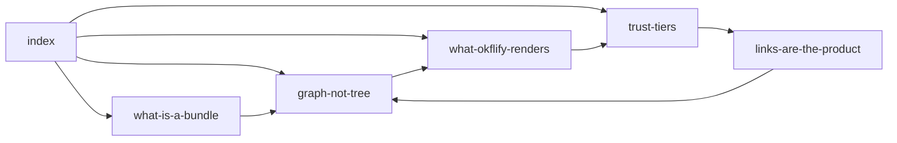

## The rule

Bundles live in folders, so every renderer reaches for a folder tree. That throws
away the actual structure: **concepts connect through ordinary markdown links**,
and the resulting network is richer than any parent-child path.

Same six files. The tree says *"four things in a folder called concepts."* The
graph says *what depends on what.*

## Both views, because both are true

okflify ships **Knowledge graph** and **Tree** side by side. The graph is the
semantics; the tree is what you can navigate once a catalogue passes ~50
documents. Neither replaces the other, and pretending the tree is the meaning is
the mistake this rule exists to prevent.

## The uncomfortable corollary

**If a bundle has no cross-links, okflify shows you a star** — every edge leaving
`index.md`, nothing between concepts. A star is not a graph, and no amount of
force-directed physics makes it one.

okflify warns on stderr when a multi-document bundle has zero edges. It is
supposed to be uncomfortable: a star means the concepts were written as chapters,
not as claims that depend on each other.

## Counter-cases

- Small bundles are legitimately star-shaped. Four documents do not owe you a
  network. The warning is about 30-document bundles that are still stars.
- A dense graph is not automatically good — links added to look connected are
  worse than none, because they make the picture lie.

## Next

[what-okflify-renders](what-okflify-renders.md) · and the learning this cost:
[links-are-the-product](../learnings/links-are-the-product.md).
