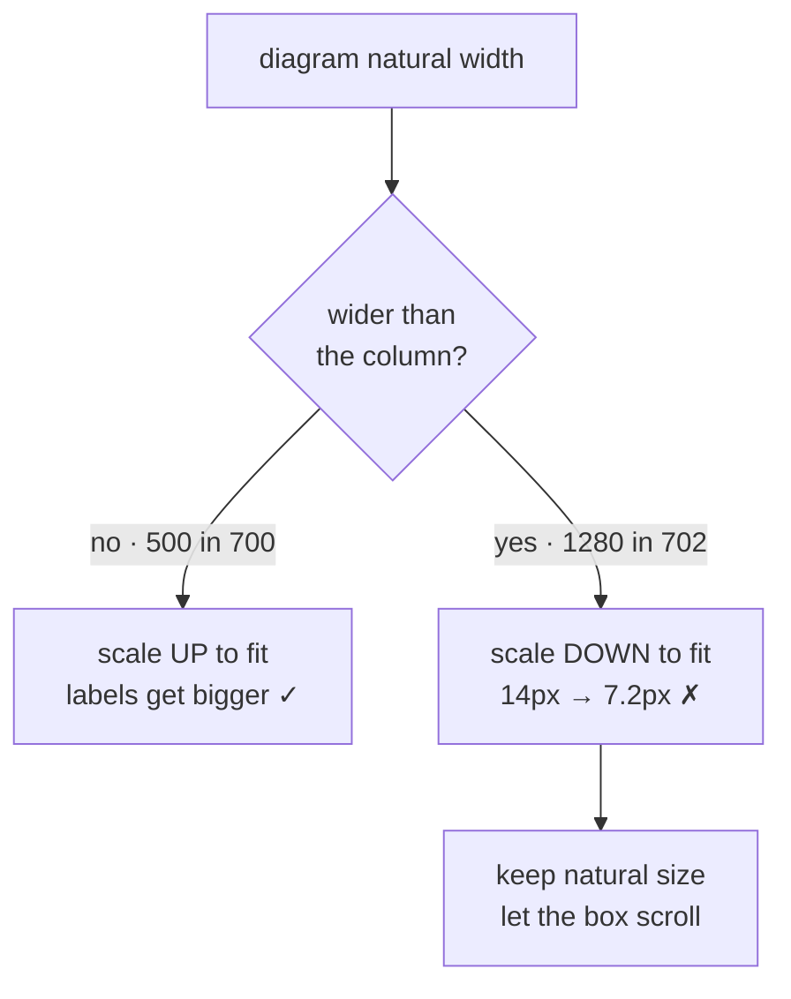

## The rule

`width: 100%` on an SVG does not mean *"fit nicely."* It means *"be exactly the
container's width"* — scaling **up** when the diagram is narrower, and **down**
when it is wider. Text scales with it.

| Natural | Column | Result |
|---|---|---|
| 500px | 700px | scaled **up** 1.4× — helps |
| 1280px | 702px | scaled **down** to 0.51× — 14px text becomes **7.2px** |

Both come from the same one-line rule. The first case is why the rule gets
added; the second is why it should not be unconditional.



## The fix

Scale up when there is room; keep natural size and scroll when there is not.

```js
svg.style.width = (natural < available ? Math.min(available, natural*1.7)
                                       : natural) + "px";
```

A horizontal scrollbar is a worse look and a better read. A zoomable lightbox
covers the rest.

## Counter-cases

- On phones, natural size means most diagrams scroll. Acceptable — unreadable-
  but-fully-visible is not a kinder failure.
- Redesigning a too-wide diagram beats scaling it. `flowchart TB` instead of
  `LR` often removes the problem entirely.
- Raster images differ: downscaling a photo degrades gracefully. Text does not.

## Next

The mechanism was easy once measured. The real question is why nothing caught
it — [passing-checks-missed-it](passing-checks-missed-it.md).
