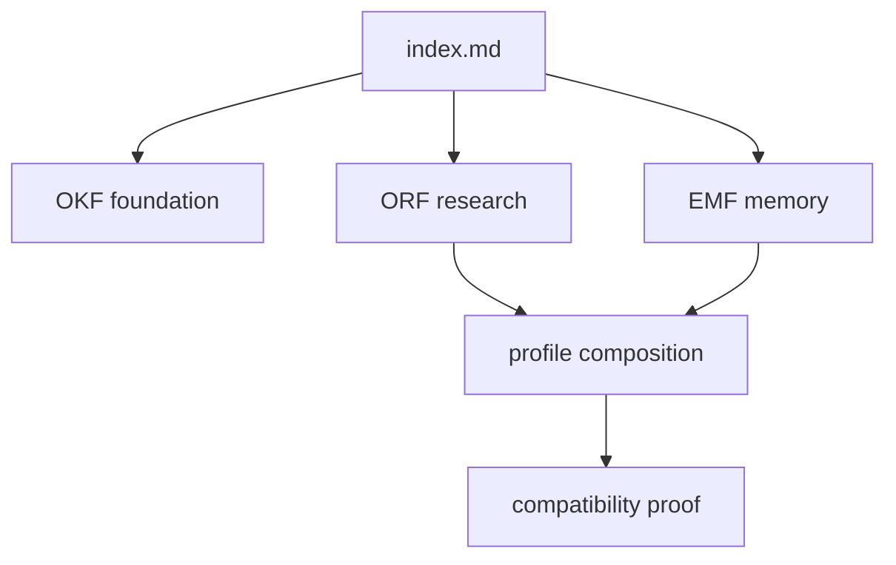

# OKF v0.2 foundation

Open Knowledge Format is a file contract for knowledge that must remain useful
to humans, agents, source control, and simple tools. An OKF bundle is a directory
of Markdown documents. YAML frontmatter carries identity and trust; ordinary
Markdown links carry relationships; Git carries history.

## The unit is a document

Every concept is a Markdown file with frontmatter:

```yaml
---
okf_version: "0.2"
type: claim
title: "The renderer emits one portable HTML file"
sources:
  - repo: eidos-agi/okflify
verified:
  by: job:okflify-build
  at: 2026-08-06
  method: "built the packaged guide and opened it from the generated file"
  stale_after: 2026-11-06
---
```

The body explains the concept. The frontmatter lets readers reason about what
kind of statement it is and how much weight it deserves before accepting it.

Common OKF types include `claim`, `rule`, `learning`, `question`,
`evidence-pointer`, and `investigation`. Profiles may add types—EMF adds
`intent` and `unresolved`—without changing the base document shape.

## The unit of distribution is a bundle

```text
bundle/
  index.md          required face and reading entry point
  log.md            append-only history; frontmatter optional
  concepts/*.md     claims, rules, questions, definitions
  evidence/*.md     observations and reproducible proof
  learnings/*.md    promoted conclusions and durable practice
  docs.json         optional presentation configuration
```

Only `index.md` is required. The conventional sections improve navigation and
make different epistemic roles visible, but OKF is not a rigid content
management system. A catalogue is a directory containing multiple bundles.

## The graph is the real structure

Directories answer **where a file is stored**. Links answer **what a concept is
connected to**. OKF therefore treats Markdown links as edges:



A folder-only renderer can show an outline while hiding the cross-cutting
relationships that make the bundle useful. OKFlify exposes both: a predictable
tree for browsing and a link graph for understanding.

## Trust is ordered

OKF v0.2 uses an explicit ladder:

| Tier | Meaning | Typical producer |
|---|---|---|
| `human:` | A person directly confirmed, decided, or stated it | `human:daniel` |
| `job:` | A named machine check measured it | `job:okflify-build` |
| `agent:` | An agent reasoned, synthesized, or self-reported it | `agent:codex` |

The order is `human: > job: > agent:`. More agent prose does not outweigh one
live human direction. A repeatable job is stronger than an agent assertion, but
the job must still say what it measured. EMF strengthens that rule by requiring
a validated `sensor` for `job:` memory.

## Verification has four useful parts

- `by` identifies the tier and actor.
- `at` says when the check happened.
- `method` says **how** it was checked; this is the field that makes the badge auditable.
- `stale_after` sets the point after which the claim must stop silently governing.

“Verified” without a method is only confidence. Freshness matters because a
correct operational fact can become false while its prose still reads
perfectly.

## Sources and evidence are not the same as authority

Sources support a knowledge claim. Authority decides what the system should do.
That distinction is why EMF has `type: intent`: a pile of evidence can refute a
fact, but cannot vote away a person's goal. It is also why ORF grades findings
separately from OKF's author tier: source independence and producer authority
answer different questions.

## What OKF does not prescribe

OKF does not require a database, daemon, central warehouse, web host, or editor.
It does not decide where every organization stores every bundle. Repos own their
knowledge beside the work; renderers and validators operate on that source.

Next: [how OKFlify reads and presents this contract](okflify-renderer.md).
