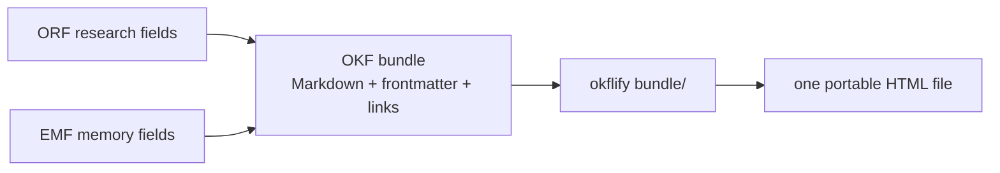

# OKFlify

OKFlify turns a directory of linked Markdown knowledge into **one readable,
self-contained HTML file**. It is the reference reader for **OKF v0.2** and it
also renders the additive **ORF v0.2.0** research profile and **EMF v0.1** memory
profile.

The shortest useful model is:



OKFlify is deliberately small. It does not own the knowledge, edit it, host a
database, or invent a second schema. It reads files already owned by a repo,
makes their trust and relationships visible, and emits an artifact that opens
from disk or can be served as a static page.

## Read this guide in order

| Page | What it explains |
|---|---|
| [OKF foundation](concepts/okf-foundation.md) | Bundle structure, document types, links, trust tiers, verification, and freshness |
| [OKFlify renderer](concepts/okflify-renderer.md) | CLI, discovery, graph/tree/document views, theming, portability, mobile behavior, and limits |
| [ORF research profile](concepts/orf-research.md) | Approved research questions, plans, findings, evidence grades, and conformance gates |
| [EMF memory profile](concepts/emf-memory.md) | Human intent, altitude, concerns, sensors, contradictions, and resolution order |
| [Profile composition](learnings/profile-composition.md) | Why ORF and EMF extend OKF instead of forking it, and how research becomes durable memory |
| [Compatibility proof](evidence/compatibility.md) | The concrete packs, commands, versions, and output checks used against this release |

## Install and render

```sh
python -m pip install okflify
okflify --example --open
okflify /path/to/okf-bundle -o /tmp/knowledge.html
```

The output contains the documents and navigation data inline. There is no
application server and no generated asset directory to keep beside the file.
Mermaid diagrams are rendered by the browser when online; the knowledge,
frontmatter-derived trust display, navigation, graph data, and prose are all in
the HTML.

## Where the three formats meet

**OKF is the base contract.** It says what a knowledge document is, how bundles
are laid out, how documents link, and how trust is represented.

**ORF is the research face.** It adds the question, approval, plan, research
status, and evidence grades needed to make an investigation auditable.

**EMF is the memory face.** It adds attributed human intent, authority altitude,
links to work systems, machine-sensor provenance, supersession, and explicit
unresolved contradictions.

**OKFlify is the reader.** It renders all three because every ORF or EMF document
remains a valid OKF document. Unknown profile fields are preserved in source and
do not require a separate rendering engine.

## The governing constraint

Trust is not decoration. `human:` outranks `job:`, which outranks `agent:`. A
page verified only by an agent is labelled as such; a format about provenance
would defeat itself if every claim looked equally authoritative.

Continue with [the OKF foundation](concepts/okf-foundation.md).
