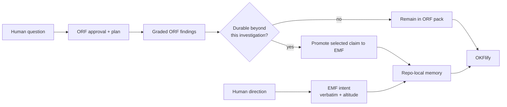

# Compose profiles instead of forking

OKF, ORF, and EMF divide responsibility by layer:

| Layer | Owns | Does not own |
|---|---|---|
| OKF v0.2 | Documents, bundles, links, base types, sources, trust, freshness | Research approval or memory conflict rules |
| ORF v0.2.0 | Question, brief, plan, research status, approval, findings, evidence grades | Human intent, capital verdicts, a global research warehouse |
| EMF v0.1 | Intent, altitude, concerns, supersession, sensors, unresolved conflicts | Research orchestration or a global memory warehouse |
| OKFlify | Reading and presenting valid OKF documents | Validating every profile-specific conformance rule |

The profile version sits beside `okf_version`:

```yaml
okf_version: "0.2"
orf_version: "0.2.0"   # when this document has the research profile
emf_version: "0.1"     # when this document has the memory profile
```

A document may carry one profile or, after a deliberate promotion, fields from
both. The base stays OKF, so a generic reader continues to work and specialized
validators can enforce the extra rules.

## Research-to-memory flow



An ORF pack remains the audit trail of the investigation. Promotion copies or
reseats only the finding that should govern future work, adds EMF concerns and
freshness, and keeps provenance back to the research. It does not rename the
whole investigation “memory.”

Human intent follows a different path. An agent must never convert its
interpretation of a conversation into `type: intent`; the human words are
recorded verbatim at human tier, or the agent writes a lower-tier claim about
what it thinks those words meant.

## Why one renderer is enough

OKFlify needs the base fields to show title, type, trust, body, and links.
Profile fields can evolve without forcing a new HTML application. The rendered
header identifies ORF or EMF when the pack face carries a profile version, while
the detailed meaning remains in the document body and profile validator.

This is forward-compatible in the useful sense: an older OKF reader may not
enforce a new profile rule, but it does not lose access to the knowledge.

## The boundary to keep

“Additive” does not mean profile rules are optional. A generic renderer may
ignore them; a producer claiming ORF or EMF conformance must pass the relevant
validator. Presentation and validation are separate jobs, and combining them
would make every new profile a renderer release.

See the [compatibility proof](../evidence/compatibility.md) for the actual packs
rendered by this release.
